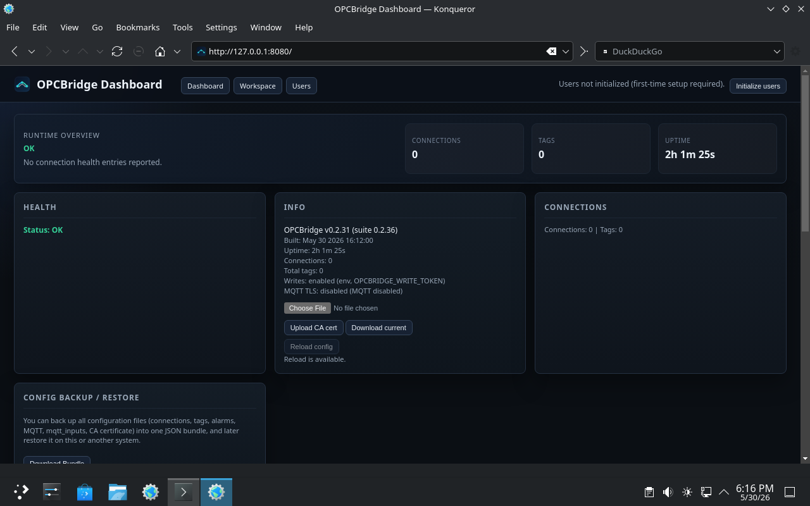
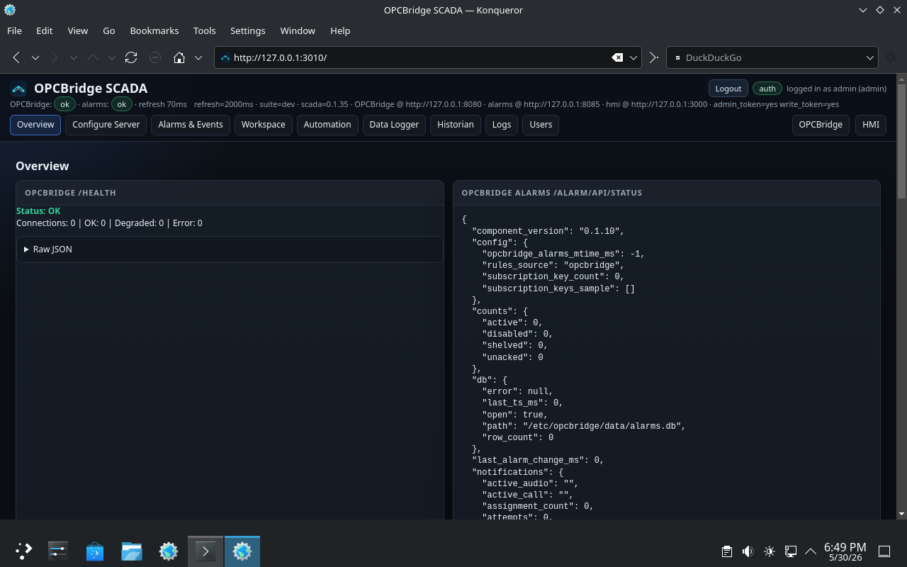
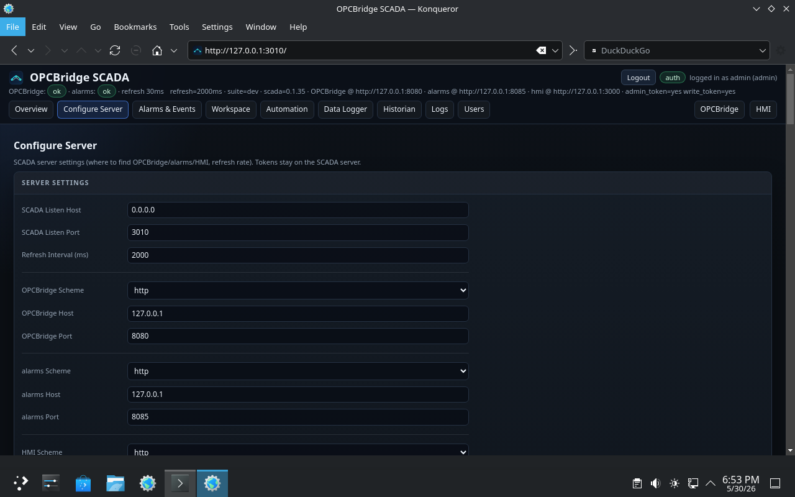
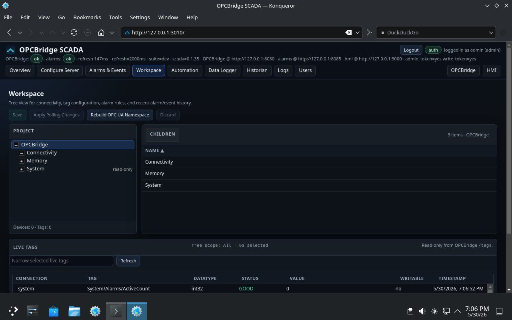
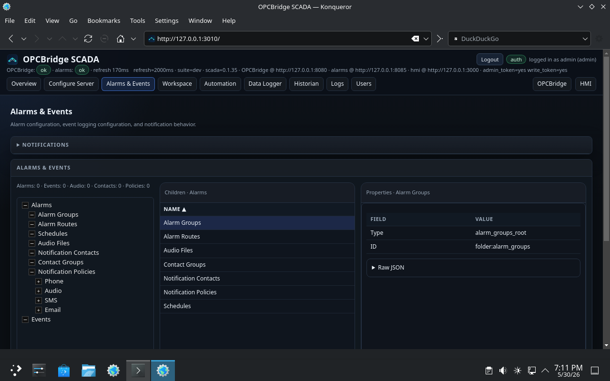
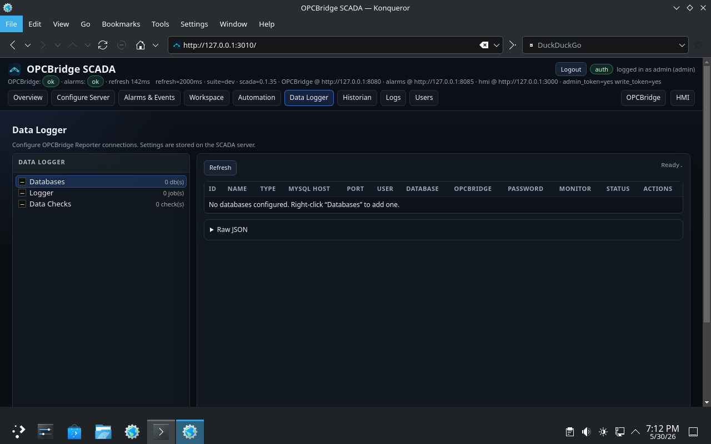
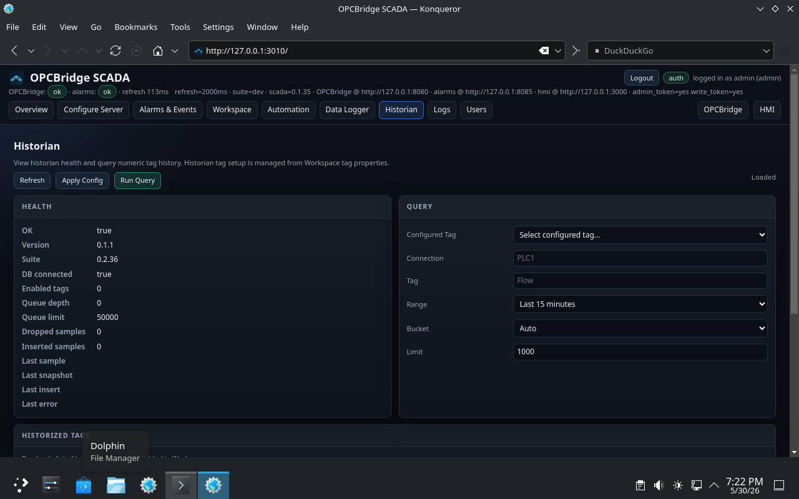
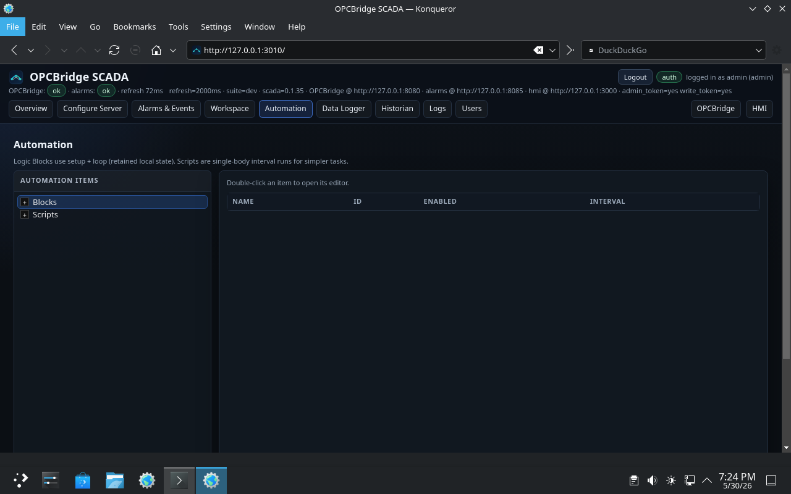
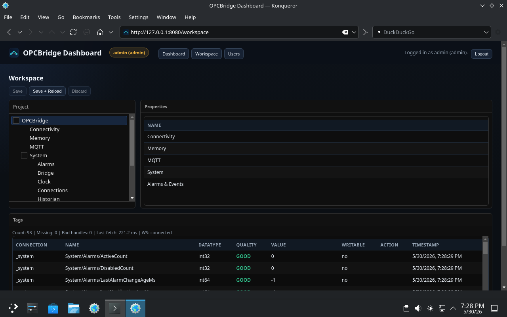
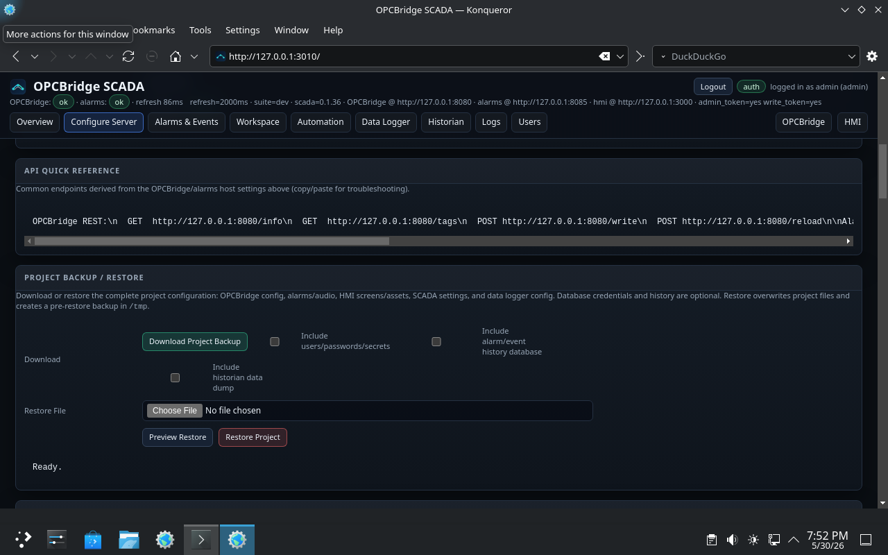

<table>
  <tr>
    <td style="vertical-align: middle; padding-right: 12px;">
      
    </td>
    <td style="vertical-align: middle;">
      <h1>OPCBridge-Suite Manual</h1>
    </td>
  </tr>
</table>

Manual version: 0.2.38  
Last updated: 2026-05-31 (America/Chicago)

Status: Draft (placeholders for screenshots)

## How to Read This Manual

- This manual is written in Markdown and **can include images**.
- Best viewing options (no VS Code required):
  - View it on GitHub (images render automatically), or
  - Install a Markdown viewer like **MarkText** / **Typora**, or
  - Convert to PDF with a tool like `pandoc` (optional).

## Table of Contents

1. Quick Start
2. What You Installed (Components)
3. URLs, Ports, and Services
4. Installing / Updating
5. SCADA (Configuration UI)
6. OPCBridge (Core)
7. Alarms
8. Data Logger
9. Historian
10. HMI
11. Backups / Export / Import
12. Troubleshooting
13. Appendix (Reference)

---

## 1. Quick Start

This section is written for a brand-new user on a fresh Debian 12+ system.

### 1.1 Requirements

- Debian 12+ (or derivative: Ubuntu, Linux Mint, etc.)
- `sudo` access
- Network access (to install deps and Node packages)

If your user is not in the `sudo` group (common on some Debian installs), see `1.1.1 Enable sudo`.

### 1.1.1 Enable sudo

Some installs (for example Debian 13 defaults in some setups) may not add the first user to sudoers.

1. Become root (one of the following will work, depending on your install):

```bash
su -
```

or:

```bash
su root
```

2. Ensure `sudo` is installed:

```bash
apt update
apt install -y sudo
```

3. Add your user to the `sudo` group:

```bash
usermod -aG sudo <username>
```

4. Log out and log back in (or reboot) so group membership is refreshed.

### 1.2 Install

1. Install prerequisites:

```bash
sudo apt update
sudo apt install -y git
```

2. Clone the repository:

```bash
git clone https://github.com/spstiles/opcbridge-suite.git
cd opcbridge-suite
```

3. Run a full install (suite + deps, including Node deps for SCADA/HMI):

```bash
sudo ./install.sh --full --deps -y
```

If you want SIP callout support (build/install pjproject `pjsua`):

```bash
sudo ./install.sh --full --deps --with-pjsip -y
```

### 1.3 First Login

1. Open the OPCBridge dashboard in a browser:

- `http://<host>:8080/`

Notes:

- `<host>` can be the server hostname (if DNS works on your LAN) or the server IP address (common for headless installs).
- If you are running SCADA on the same machine as the server, you can use `http://127.0.0.1:8080/`.

Screenshot placeholder: OPCBridge dashboard header (shows `Initialize users` before any accounts exist, and `Admin login` after initialization).

2. On a fresh install, click `Initialize users` (this button replaces `Admin login` until the first account exists), then run first-time initialization to create the initial admin user/password.

Notes:

- This creates the centralized user store (typically `passwords.jsonc` under the config directory).
- The default config directory is usually `/etc/opcbridge` (installer flag: `--config DIR`).
- Without this step, the configuration UIs will remain locked.



3. Open SCADA in a browser.



4. Go to the Configure Server tab and confirm you can:

- see versions
- see service status
- test audio (if applicable)



---

## 2. What You Installed (Components)

OPCBridge-Suite is a complete SCADA stack including:

1. OPCBridge: communication layer (drivers, tags, OPC UA, REST).
2. OPCBridge-SCADA: system configuration UI.
3. OPCBridge-Logger: scheduled data logger and data checks (configured from SCADA).
4. OPCBridge-Alarms: alarm server (alarm logic + notifications).
5. OPCBridge-Historian: time-series historian.
6. OPCBridge-HMI: HMI runtime + editor.

Notes:

- The suite is designed to run on a headless system.
- Most configuration is managed through OPCBridge-SCADA. JSON config exists for advanced/manual operations.

---

## 3. URLs, Ports, and Services

This repo uses systemd services. The defaults can vary by install flags and `/etc/opcbridge/opcbridge.env`.

### 3.1 Common URLs

Screenshot placeholder: SCADA Configure Server tab showing URLs/ports.

- OPCBridge HTTP API: `http://<host>:8080`
- OPCBridge SCADA UI: `http://<host>:3010`
- OPCBridge Alarms API/UI: `http://<host>:8085` (API), UI via SCADA
- OPCBridge HMI: `http://<host>:3020` (typical; depends on install/env)

### 3.2 Common Services

- `opcbridge`
- `opcbridge-alarms`
- `opcbridge-scada`
- `opcbridge-hmi`
- `opcbridge-logger`
- `opcbridge-historian`

---

## 4. Installing / Updating

### 4.1 Installer Overview

The primary supported install path is `install.sh`.

Common install flags:

- `--full`: install/build the suite components
- `--deps`: install dependencies (apt + source builds; includes Node deps for SCADA/HMI)
- `--with-node-deps`: install Node dependencies only (useful with `--hmi-only` / `--scada-only`)
- `--with-pjsip`: install/build pjproject utilities needed for SIP callouts (if you use SIP)
- `-y`: auto-confirm

Note: exact flags evolve; `./install.sh --help` is the source of truth.

### 4.2 Updating an Existing System

Typical update flow:

1. Pull new code:

```bash
cd /opt/opcbridge-suite
sudo git pull
```

2. Re-run the installer with the same profile/flags you used originally. Common examples:

```bash
# full suite (no deps)
sudo ./install.sh --full

# full suite + deps (includes Node deps)
sudo ./install.sh --full --deps -y

# full suite + deps + SIP callout support (pjsua)
sudo ./install.sh --full --deps --with-pjsip -y
```

After updating, confirm the running versions in **SCADA → Configure Server** (versions are shown near the top of the page/card, as in the Configure Server screenshot in the Quick Start section).

---

## 5. SCADA (Configuration UI)

This section documents the SCADA UI at a user-workflow level.

### 5.1 Configure Server

Purpose:

- View versions
- Apply server-level settings
- Run diagnostics (audio tests, TTS tests, etc.)


#### 5.1.1 Refresh Interval

SCADA uses a refresh interval (shown on the Configure Server tab as “Refresh” / “Refresh interval”) to control UI polling.

- Smaller values = more responsive UI, more CPU/network usage
- Larger values = less load, slower updates

### 5.2 Workspace

Purpose:

- Configure connections and tags
- Create alarms and alarm groups/sites (if enabled in your build)



Common workflows:

- Add a PLC/Modbus connection
- Add tags (including arrays, derived tags, scaling)
- Reload/apply changes

### 5.3 Alarms & Events

Purpose:

- Configure alarm routing/schedules
- Manage alarm audio (site vs alarm audio)
- Verify active/returned events



### 5.4 Data Logger

Purpose:

- Configure data-logger database connections
- Configure logging jobs
- Configure data checks



Notes:

- **Databases**: connection profiles; supports testing entered settings before saving; supports monitoring/health checks.
- **Logger**: scheduled jobs that sample selected tags and write rows to a database table.
- **Data Checks**: scheduled SQL checks for health/QA (first column of first row is the check value; optional low/high thresholds).

SQL Server connection testing and database health monitoring are available
through the open-source FreeTDS ODBC driver. Install or update Logger with:

```bash
sudo ./install.sh --components logger --with-odbc --odbc-driver freetds
```

In **Data Logger → Databases**, select **SQL Server (ODBC)** and leave the
driver name as `FreeTDS`. Enter the SQL Server host, port (normally `1433`),
database, username, and password. OPCBridge builds the ODBC connection string;
a system DSN or manually edited `odbc.ini` file is not required. Use **Test
Connection** before saving. SQL Server schema discovery, report queries, data
checks, and scheduled logger writes are subsequent support phases and are not
enabled by this initial connection milestone.

Example “previous calendar day” data-check query:

```sql
SELECT COUNT(*) AS value
FROM your_table_name
WHERE your_timestamp_column >= CURDATE() - INTERVAL 1 DAY
  AND your_timestamp_column < CURDATE();
```

Useful system tags include:

- `System/Logger/DataChecks/<check_id>/Ok`
- `System/Logger/DataChecks/<check_id>/Value`
- `System/Logger/DataChecks/<check_id>/LastError`
- `System/Logger/Databases/<database_id>/Ok`
- `System/Logger/Databases/<database_id>/LatencyMs`
- `System/Logger/Databases/<database_id>/LastError`

### 5.5 Historian

Purpose:

- Configure historian backend
- Inspect historian health



### 5.6 Automation

Purpose:

- Configure automations that transform/route data
- (Future) MQTT mappings UI if/when exposed here



Common helpers (as seen in the helper/reference panel):

- `tag(...)`, `quality(...)`, `hasTag(...)`
- `map(...)`, `clamp(...)`, `round(...)`, `min(...)`, `max(...)`
- `bit(...)`, `bits(...)`
- `json(...)`, `jsonObj(...)`, `jsonArray(...)`
- `str(...)`, `num(...)`, `bool(...)`, `concat(...)`, `lower(...)`, `upper(...)`, `trim(...)`

### 5.7 Logs

The Logs tab presents service journals and structured application history in a
consistent table. Sources include system services, OPCBridge runtime
diagnostics, alarm history, tracked tag events, and HMI audit records.

- Changing the source refreshes the results automatically.
- Results do not update continuously; use **Apply Filters** to refresh them.
- Quick buttons select the last hour, 24 hours, 7 days, 14 days, or 30 days.
- Source-specific filters appear for alarm, tag-event, and HMI-audit sources.
- Select a row to inspect its complete structured details.
- **Download CSV** exports the currently displayed records.

The recent alarm table on **Alarms & Events** includes **View Full History**,
which opens the Logs tab with Alarm History selected and a seven-day range.

---

## 6. OPCBridge (Core)

OPCBridge is the communications core of the suite. It provides:

- PLC/RTU connections (`ab_eip`, `modbus_tcp`, `mqtt`)
- Tag polling (including arrays/block reads, derived tags, scaling)
- REST API + WebSockets for clients
- OPC UA server
- MQTT publish + command handling (optional/when enabled/configured)



### 6.1 Configuration Locations

Default paths (installer defaults; can be changed via install flags/env):

- Config root: `/etc/opcbridge`
- Connections: `/etc/opcbridge/connections/*.json`
- Tags: `/etc/opcbridge/tags/*.json`
- MQTT (broker + publish/subscribe settings): `/etc/opcbridge/mqtt.json`
- MQTT telemetry input mappings (optional): `/etc/opcbridge/mqtt_inputs.json`
- Alarms config: `/etc/opcbridge/alarms.json` or `/etc/opcbridge/alarms/` (depending on component/config mode)

### 6.2 Connections (Drivers)

Connections define how OPCBridge talks to a PLC/RTU/broker.

Supported drivers commonly used in the suite:

- Allen-Bradley EtherNet/IP (`ab_eip`)
- Modbus TCP (`modbus_tcp`)
- MQTT (`mqtt`)

Screenshot placeholder: SCADA Workspace connection editor (Allen-Bradley / Modbus / MQTT).

#### 6.2.1 Allen-Bradley EtherNet/IP (`ab_eip`)

Example:

```json
{
  "id": "ControlLogix1",
  "driver": "ab_eip",
  "gateway": "192.168.1.10",
  "path": "1,0",
  "slot": 0,
  "plc_type": "lgx"
}
```

Notes:

- `gateway` is the PLC IP/host.
- `path` is the CIP route (common: `1,0`).
- `plc_type` selects the libplctag driver type (Logix, SLC, MicroLogix, etc.).

#### 6.2.2 Modbus TCP (`modbus_tcp`)

Example:

```json
{
  "id": "Micrologix_Modbus",
  "driver": "modbus_tcp",
  "gateway": "192.168.12.233:502",
  "path": "1",
  "plc_type": "modbus_tcp"
}
```

Notes:

- `gateway` is the Modbus server (IP/host + optional port; default is `502`).
- `path` is the Modbus Unit ID (server id). If omitted, `1` is commonly used.

#### 6.2.3 MQTT Broker (`mqtt`)

MQTT connections are used for:

- subscribing to configured topics (telemetry into OPCBridge, via `mqtt_inputs.json` or connection `settings.messages`)
- publishing tag telemetry (via `mqtt.json` global settings and/or per-connection `settings.publications`)

In the suite workflow, MQTT extraction/mapping is typically handled through Automation/SCADA configuration rather than creating “MQTT tags” directly.

Note: `mqtt_inputs.json` still exists for defining input/topic mappings, but some setups also keep telemetry mappings directly in the MQTT connection’s config (`settings.messages`). If you don’t use telemetry inputs, you may not need `mqtt_inputs.json`.

### 6.3 Tags

Tags define what OPCBridge reads/writes and exposes to clients.

Screenshot placeholder: SCADA Workspace tag editor (direct tag + derived tag + scaling).

Each tag belongs to one connection:

```json
{
  "connection_id": "ControlLogix1",
  "tags": [
    {
      "name": "Pump1.Running",
      "plc_tag_name": "Pump1.Running",
      "datatype": "bool",
      "scan_ms": 1000,
      "enabled": true,
      "writable": false
    }
  ]
}
```

#### 6.3.1 Direct PLC Tags

Common fields:

- `name`: logical name (what UIs and clients use)
- `plc_tag_name`: PLC address/tag (driver-specific)
- `datatype`: `bool`, `int16`, `uint16`, `int32`, `uint32`, `float32`, `float64`, `string`
- `scan_ms`: poll interval (best effort)
- `enabled`: optional (default true)
- `writable`: optional (default false)
- `invert`: optional (bool only)

#### 6.3.2 Arrays / Block Reads (`elem_count`)

For Logix, you can read a contiguous array/block by setting `elem_count > 1`.

- The “root” tag is the handle for the block read.
- Individual elements are exposed as `TagName[0]`, `TagName[1]`, ...

Guidance: prefer multiple moderate-size blocks over a single huge one (split by scan rate and by size).

#### 6.3.3 Derived Tags

Derived tags reuse other tag values:

- `derived_bit`: `source_tag` + `bit` (0=LSB) → produces `bool`
- `derived_alias`: `source_tag` (no `bit`) → republishes value under a new name (optionally scaled)

Example (derived bit):

```json
{
  "name": "Pump1.FaultBit3",
  "source_tag": "Pump1.StatusWord",
  "bit": 3,
  "datatype": "bool",
  "scan_ms": 1000
}
```

#### 6.3.4 Linear Scaling

Scaling is optional and applies to numeric tags (direct and derived alias):

```json
{
  "name": "Tank.LevelPct",
  "plc_tag_name": "Tank.LevelRaw",
  "datatype": "uint16",
  "scan_ms": 1000,
  "scaling": "linear",
  "raw_low": 0,
  "raw_high": 4095,
  "scaled_low": 0,
  "scaled_high": 100,
  "clamp_low": true,
  "clamp_high": true,
  "scaled_datatype": "float32"
}
```

#### 6.3.5 Modbus Tag Addresses (Friendly)

For Modbus, tags can be configured with friendly fields:

```json
{
  "name": "TankLevel",
  "register_type": "holding_register",
  "address": 40001,
  "datatype": "uint16",
  "scan_ms": 1000
}
```

Supported `register_type` values:

- `coil`
- `discrete_input`
- `holding_register`
- `input_register`

Word order (for `int32`, `uint32`, `float32`) can be selected with:

- `word_order`: `hi_lo` or `lo_hi`

### 6.4 REST API (Most Used Endpoints)

The REST API is served by OPCBridge (default `http://<host>:8080`).

- `GET /info` (versions and basic status)
- `GET /tags` (tag snapshots)
- `POST /write` (write to a writable tag)
- `POST /reload` (reload configuration)

Screenshot placeholder: SCADA Configure Server showing versions and URLs.

Note: The SCADA **Configure Server** tab also includes an **API Quick Reference** card that lists common REST endpoints derived from your configured host/port settings.



### 6.5 WebSockets (Live Updates)

OPCBridge exposes WebSockets for streaming updates (used by some services and optional tools).

Typical workflow:

1. Find the WebSocket URL in the SCADA Configure Server tab (or service/env settings).
2. Connect with a WebSocket client (browser extension, CLI tool, or your app).
3. Observe incoming JSON messages (for example tag updates).

---

## 7. Alarms

This section covers alarm configuration, callouts, and acknowledgement behavior.

Screenshot placeholder: Alarm routing and phone policy settings.

Key concepts:

- Alarm definition (condition, site, group, severity, messages)
- Routing (which alarms go to which notification outputs)
- Schedules (when routes are active)
- Notifications (phone/SIP callout, etc.)

### 7.1 Alarm Definitions

An alarm definition typically includes:

- `id`, `name`, `enabled`
- source (`connection_id` + `tag_name`)
- condition (`equals`, thresholds, etc.)
- activation delay (the longer of the per-alarm delay and global alarm delay)
- `severity`
- `site`, `group`
- optional `audio_file` (WAV) and active/return messages

### 7.2 Routing + Schedules (Operational Model)

Operationally:

- Alarms describe *what happened*.
- Routes describe *who gets notified* and *during which schedule*.

If a route’s schedule is not active, the alarm may be evaluated but notification delivery is skipped.

### 7.3 Phone Callouts (Voice Modem or SIP)

Phone notifications are delivered through a “call backend”:

- **Voice modem** (POTS-style dial-out hardware), or
- **SIP** (VoIP calls via a SIP server).

Both are configured and tested through SCADA, with settings stored on the server.

### 7.4 Acknowledgement (DTMF)

If acknowledgement is enabled:

- The call plays audio (site + alarm audio).
- The system waits for DTMF.
- If the configured acknowledge key(s) are received, the alarm is acknowledged and repeats/escalation stop (depending on policy/route settings).

### 7.5 Repeat / Escalation

Repeat behavior is controlled by the routing/notification configuration:

- interval between attempts
- maximum repeats (0 or blank may mean “indefinite”, depending on config)
- stop conditions (acked, returned, etc.)

### 7.6 Email Notifications (SMTP)

In addition to phone callouts, alarms can be delivered via **email**.

How it works:

- Configure **SMTP Email Settings** in **SCADA → Configure Server** (host/port/security/credentials/from address).
- Ensure the contact(s) you want to notify have an `email` value.
- Create an **email notification policy** (policy output type `email`) and reference the desired targets/contacts.
- Routes + schedules still control when email notifications are active (same as other outputs).

Notes:

- SCADA includes a **Send Test Email** button to validate SMTP settings.
- Email policies support optional subject/body templates (advanced).

---

## 8. Data Logger

Configured via the SCADA Data Logger tab.

Key concepts:

- Databases
- Logger jobs (tree-based editor)
- Database Sync jobs
- Data checks

Notes:

- The Data Logger UI is organized as a **tree** (Databases / Logger / Database Sync / Data Checks).
- You select an item in the tree to edit it in the right pane (rather than a dedicated “jobs list” view).
- A Database Sync job fills missing data between existing MySQL tables. Jobs may run one way or bidirectionally, and can match records by tag plus exact timestamp, minute, hour, or day. When several records occupy one configured period, the last available record is used. Sync never creates or alters schemas and never overwrites a conflict.
- Sync jobs support all or selected tags, scheduled and manual runs, a configurable lookback window for backdated entries, automatic same-name value mappings, and advanced manual column mappings.
- Dry Run opens a Database Sync Review grouped by collapsible tag. It aligns Database A and Database B records, highlights missing periods and conflicts, and allows reviewed missing records to be synchronized while leaving conflicts untouched.
- Minute/hour/day matching is presence-based: if both databases contain the tag anywhere in the configured period, the period is considered present on both even when sampling seconds and values differ. Value conflicts are evaluated only for exact-timestamp matching.
- Sync-job IDs are generated internally when a job is first saved. Operators work with the friendly name, which can be changed later without breaking references.


---

## 9. Historian

Key concepts:

- Storage backend (Postgres/TimescaleDB)
- Retention
- Performance tuning


### 9.1 What It Does

- Subscribes to opcbridge tag updates via WebSocket (change-based recording), and/or
- Performs periodic HTTP snapshots (`GET /tags`) for periodic sampling.

### 9.2 Health API

The historian typically exposes a local health/query API (port depends on config), for example:

- `/health`
- `/summary?...` (returns last/min/max/avg/twa/count)
- `/query?...` (returns raw points or bucketed rows)

`twa` is a step/last-value-held time-weighted average over the requested range.

---

## 10. HMI

Key concepts:

- Runtime pages
- Editor mode
- Binding tags to widgets

Screenshot placeholder: HMI page runtime + editor toggle.

---

## 11. Backups / Export / Import

This section documents recommended ways to back up and redeploy configurations.

Key concepts:

- CSV export/import for alarms (fast redeploy)
- JSON export/import for full config (advanced)

Screenshot placeholder: Export CSV / Import CSV workflows.

---

## 12. Troubleshooting

### 12.1 Check Service Status

```bash
systemctl status opcbridge --no-pager -l
systemctl status opcbridge-scada --no-pager -l
systemctl status opcbridge-alarms --no-pager -l
```

### 12.2 Check Logs

```bash
journalctl -u opcbridge -n 200 --no-pager
journalctl -u opcbridge-scada -n 200 --no-pager
journalctl -u opcbridge-alarms -n 200 --no-pager
```

### 12.3 Common Issues

- No tag updates (connection down, wrong path/unit id, firewall)
- Modbus: port 502 unreachable until PLC reboot/config applied
- Alarm callout: missing `pjsua` / SIP routing / VPN routing

---

## 13. Appendix (Reference)

### 13.1 Reference Notes

- System tags: `docs/system_tags.md`
- Architecture notes: `docs/architecture.md`

### 13.2 Glossary

- **OPC UA**: industrial protocol for exposing a browsable address space of variables.
- **Companion Specification**: a standardized OPC UA information model for a specific domain/vendor.
- **Custom namespace**: a project-specific OPC UA information model (names + nodes defined by the application).
